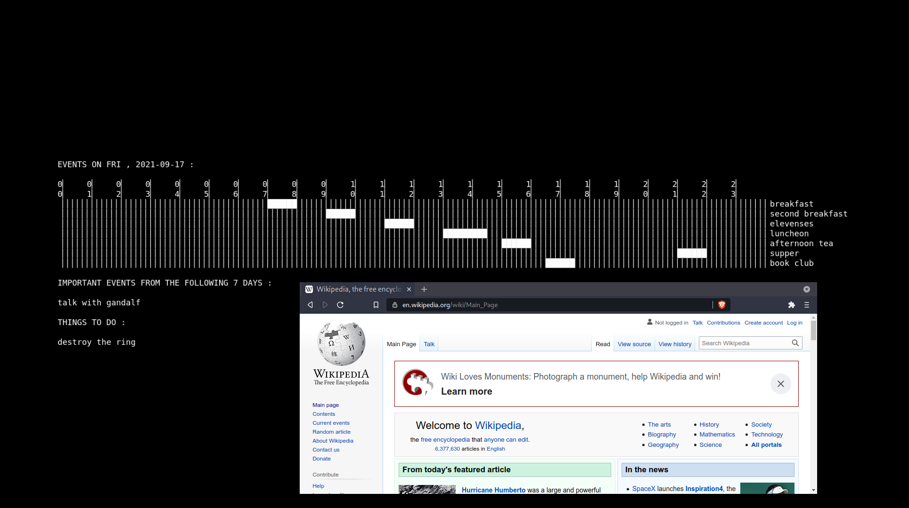
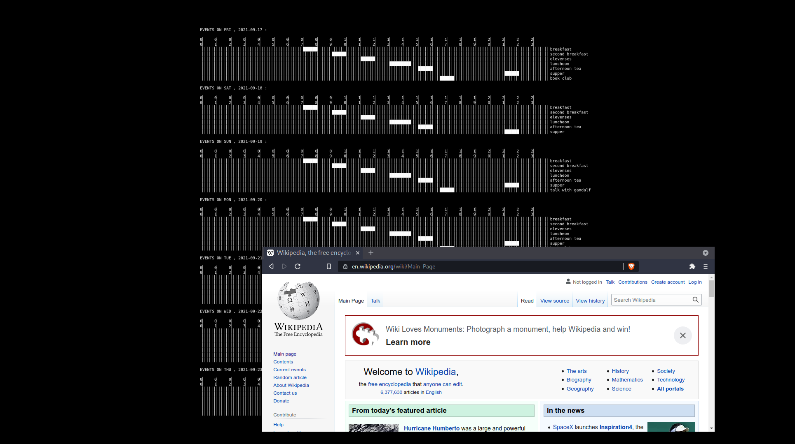

# wallCal

Have your calendar appear as the wallpaper.



# disclaimer 

Use at your own risk. Don't blame me if you miss a meeting :-)
Please report problems and feature requests.

# dependencies

The scripts in this repository depend 
on the following programs being available:

- `feh` (<https://feh.finalrewind.org/>)
- `convert` (part of ImageMagick <https://imagemagick.org/>)

# bash scripts

Configuration options are available 
in `CONFIGURATION` sections of each script.

CAREFUL: the first thing you might want
to change is the `FONT` in `wallPipe`.
By default it is `"DejaVu-Sans-Mono"`
because it has box drawing characters.
The font should be mono spaced.
To list all fonts available run:

```
$convert -list font
```

## `wallDay`

USAGE: 

```
$./wallDay
```

or with the `PATH` variable set appropriately:

```
$wallDay
```

Scan for the day's events using the
calendar file `cal`. A description
of the syntax for calendar events
is described at the beginning of
this file.


The script shows:

  - a timetable
  - list of important events from 
    the following seven days
  - a todo list

on the wallpaper using `feh`.

## `wallWeek`

USAGE: 

```
$./wallWeek
```

Scan seven days, starting with the current day,
for the day's events using the
calendar file `cal`. A description
of the syntax for calendar events
is described at the beginning of
this file.

The script shows:

  - a timetable for each day

on the wallpaper using `feh`.

This can be a little cluttered but the
events are readable on a screen with 
a reasonable resolution:



## `wallPipe`

USAGE EXAMPLE: 

```
$ls | ./wallWeek
```

Takes stdin and shows the text
on the wallpaper using `feh`.

# python scripts

Configuration available in `betterCal.config`
but I suggest not modifying this file.

# `betterCalendar`

Simple calendar application, uses the
`betterCal.py` module. Help and information
is available using:

```
$./betterCalendar -h
```


